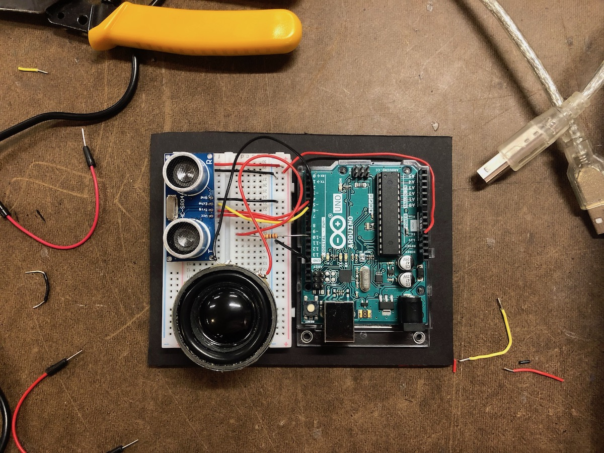
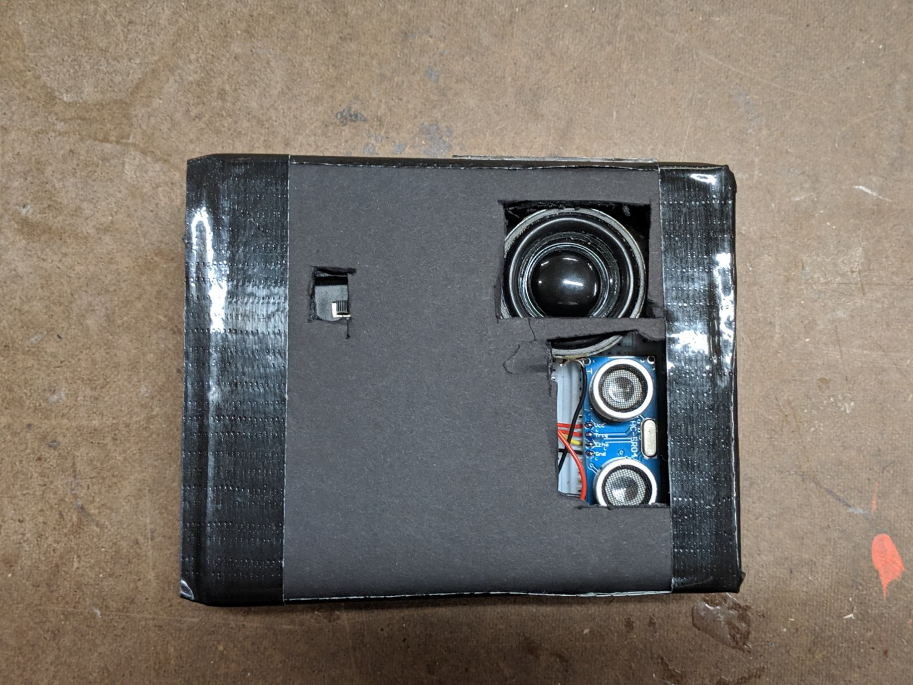
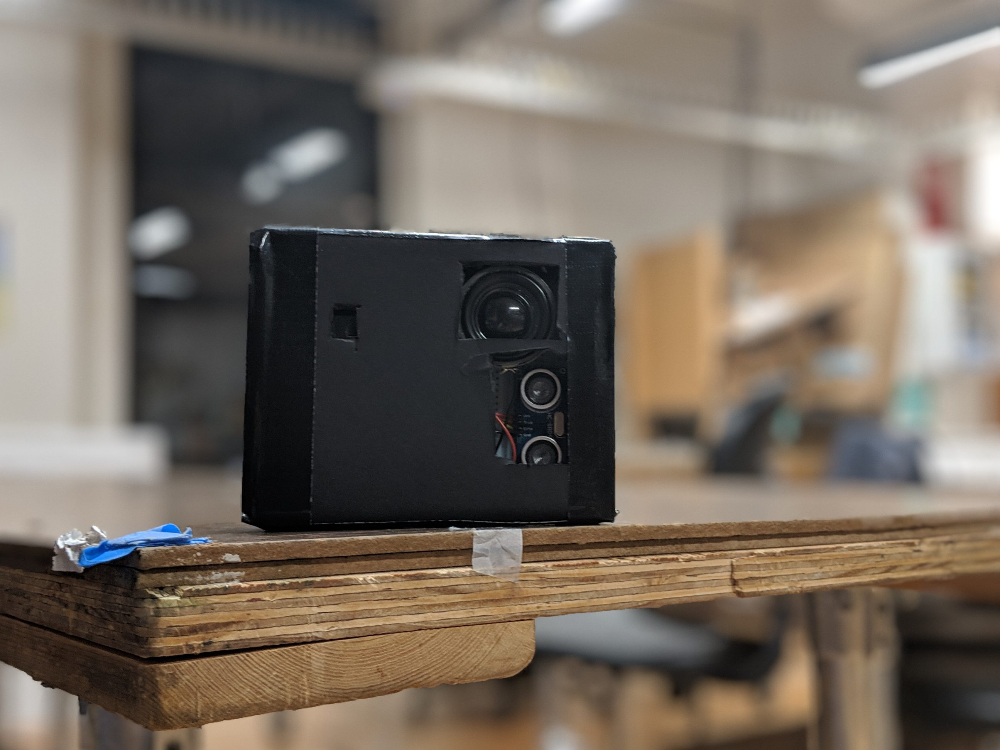

### Disobedient Electronics: Train Delay Siren

For this week's assignment, Morgan and I created a small disruptive electronic object which draws attention to the MTA subway's on-time performance problems. The device is designed to be installed just underneath the platform edge without any tools. Once installed, the device detects passing subways using its ultrasonic rangefinder sensor. If a train is determined to be delayed (enough time has passed since the last train), a siren-like alarm sound will play. A small speaker in the device plays tones of increasing volume until the next train arrives.

It's sort of a torture device for the commuters on the platform, and although they are not the direct targets of our critique with this project, we think it can still be an effective way to draw attention to the problem at hand. By highlighting the plight of the dissatisfied MTA customer, perhaps shaking them out of their mollified / pacified state of complacence with the system, this becomes a form of protest to the inefficient use of taxpayer money for public infrastructure.

### Process

We created a prototype with an Arduino Uno microcontroller and a few simple components attached to a breadboard. I was able to adapt some of the ultrasonic rangefinder & `toneAC` code from [my theremin project from last semester](../../physical-computing/week-4-simple-application/).



### Prototype

Here's a demo when we first got the basic code working:

<iframe src="https://player.vimeo.com/video/316450991?loop=1&title=0&byline=0&portrait=0" width="640" height="360" frameborder="0" webkitallowfullscreen mozallowfullscreen allowfullscreen></iframe>

Some photos of the "finished" product:





To demonstrate the functionality, we mounted the device under a table on the ITP floor and used office chairs to simulate trains passing through the station. The time scale of the interaction is greatly sped up here to show it in a short video... the real device would be programmed to wait many minutes before emitting the siren sound.

<iframe src="https://player.vimeo.com/video/316451009?loop=1&title=0&byline=0&portrait=0" width="640" height="360" frameborder="0" webkitallowfullscreen mozallowfullscreen allowfullscreen></iframe>

We considered installing it in the actual subway platform, but I figured I could very easily get arrested if I attached a small black box to a piece of public infrastructure like that, especially with all the CCTV cameras in place. So, for now, we settle for this.

### Code

```
#include <toneAC.h>

int trigPin = 5;
int echoPin = 6;

void setup() {
    Serial.begin(9600);
    pinMode(trigPin, OUTPUT);
    pinMode(echoPin, INPUT);
}

int rangeThreshold = 5000;
unsigned long lastSubwayTime = 0;
int expectedTrainSchedule = 5000; // ms

void loop() {
    float rangeDuration;
    unsigned long now = millis();

    // send a 2 microsecond pulse to start the rangefinder
    digitalWrite(trigPin, LOW);
    delayMicroseconds(2);
    digitalWrite(trigPin, HIGH);
    delayMicroseconds(10);
    digitalWrite(trigPin, LOW);

    // read from the rangefinder
    rangeDuration = pulseIn(echoPin, HIGH);

    // occasionally print sensor value
    if (now % 3 == 0) {
        Serial.print("d: ");
        Serial.println(rangeDuration);
    }

    float toneFrequency = 800;
    float toneVolume = 10;

    if (rangeDuration < rangeThreshold) {
        lastSubwayTime = now;
    } else if (now - lastSubwayTime > expectedTrainSchedule) {
        playNotes(10, 500);
    }
}

int notes[2] = { 800, 400 };
unsigned long lastNoteTime = 0;

void playNotes(int volume, int duration) {
    int i = 0;
    while (i < 2) {
        unsigned long now = millis();
        if (now - lastNoteTime > duration) {
            lastNoteTime = now;
            toneAC(notes[i], volume, duration);
            i++;
        }
    }
}
```
