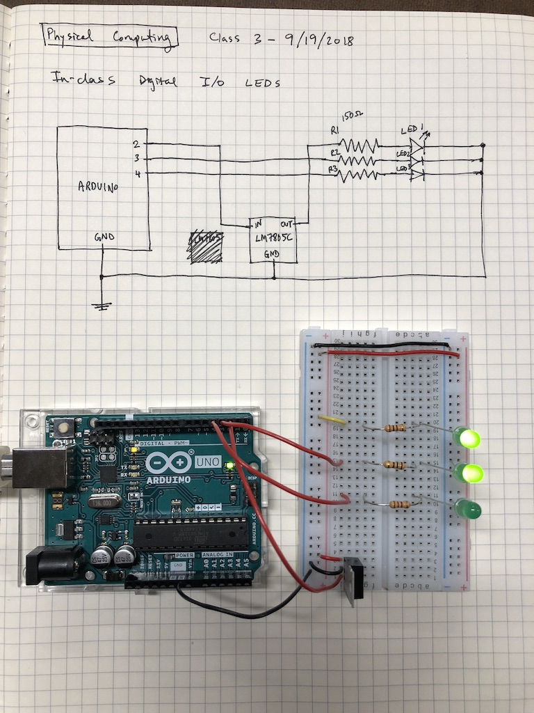

### In-class lab documentation

While learning about Arduino I/O in class, I made a simple LED blinking pattern.

<iframe src="https://player.vimeo.com/video/291969836" width="640" height="360" frameborder="0" webkitallowfullscreen mozallowfullscreen allowfullscreen></iframe>



### Code

```c
void setup() {
  pinMode(2, OUTPUT);
  pinMode(3, OUTPUT);
  pinMode(4, OUTPUT);
}

void loop() {
  blinkers();
}

int DELAY = 50;

void blinkers() {
  writeWithDelay(2, HIGH);
  writeWithDelay(3, HIGH);
  writeWithDelay(4, HIGH);
  writeWithDelay(2, LOW);
  writeWithDelay(3, LOW);
  writeWithDelay(4, LOW);
  // reverse
  writeWithDelay(4, HIGH);
  writeWithDelay(3, HIGH);
  writeWithDelay(2, HIGH);
  writeWithDelay(4, LOW);
  writeWithDelay(3, LOW);
  writeWithDelay(2, LOW);
}

void writeWithDelay(int pin, int val) {
  digitalWrite(pin, val);
  delay(DELAY);
}
```
