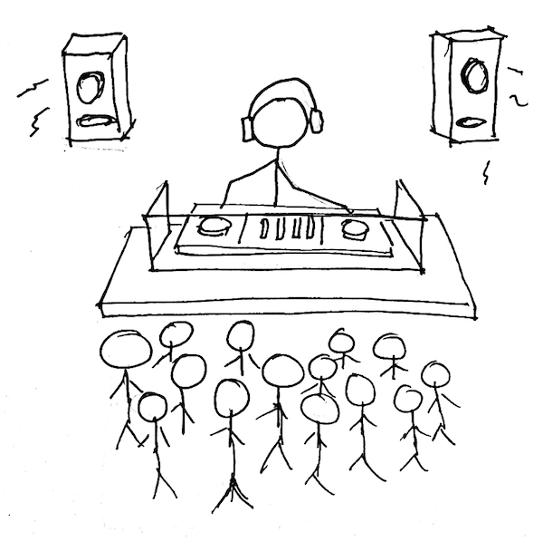

## Ideas, proposal

Lately I've been very interested in electronic dance music and the production of club environments. I just started learning how to mix as a DJ. For my final project, I want to create a device which is useful for live performance, possibly portable enough to bring around with me to gigs.

The basic idea would be to use the BPM of a currently playing track to control some LED visuals. I could get the BPM information into the Arduino either:

1. via MIDI on my computer &rarr; serial data
    - The data could be sent to the Arduino over USB or Bluetooth, so I do have the option of placing the microcontroller away from the DJ booth.

2. by detecting beats in an analog audio signal recorded with a small microphone
    - This would allow the device to be standalone and not dependent on a laptop, which could be cool. I currently use a laptop to mix with a Pioneer controller, but in a professional club setup, DJs typically don't use a laptop since the CDJs have all the necessary software.

As far as device outputs, the important part would be programming interesting LED patterns over time. I haven't done this before but I have seen a lot of inspiring work in this area which I hope to imitate.

I imagine the main __interaction loop__ with this device will be as follows:

- User selects a track and plays it at a particular BPM
- Device detects the BPM and adjusts the rate of its LED pattern
- Audience perceives a pleasing audio-visual combination
- User selects new track

If I have time, I'd also like to program a secondary collection of LED patterns which are slower and better suited to an ambient set. One practical feature of this might be that instead of pulsing some lights at 1x or 0.5x the BPM rate, this collection of patterns would pulse / change the lights at 0.5x or 0.25x the BPM rate.

Ultimately, I will measure the success of this device by using it at a party and verbally gauging audience reactions.

## Research

Some preliminary research on beat detection:

- https://electronics.stackexchange.com/questions/148085/fft-beat-detection-circuit
- https://dsp.stackexchange.com/questions/9521/simple-beat-detection-algorithm-for-microcontroller
- https://bochovj.wordpress.com/2013/07/07/bass-detection-with-arduino/

## Inspiration

Some artists & engineers whose live performance installations I admire:

- http://www.nitemind.us/
- http://www.daveandgabe.care/
