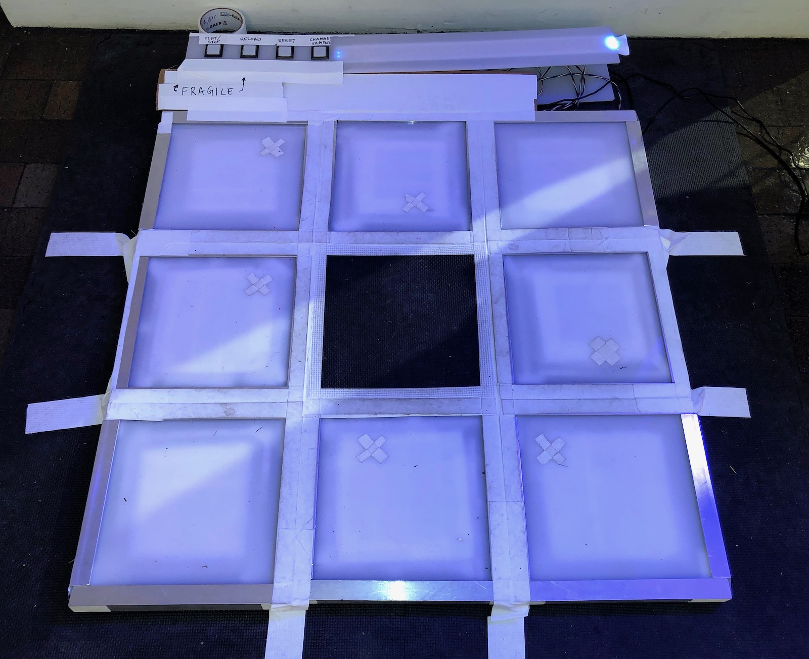
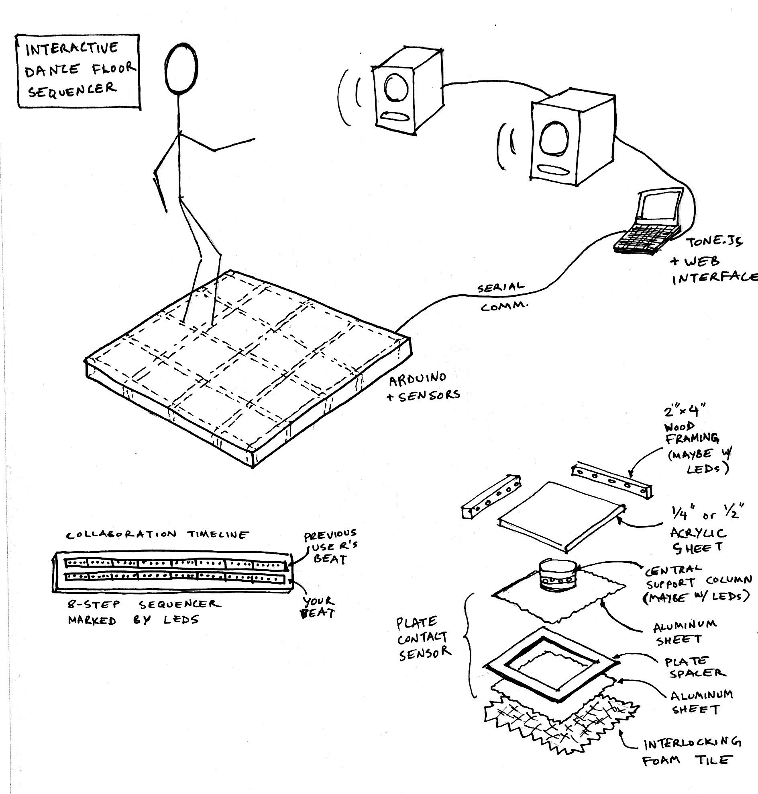
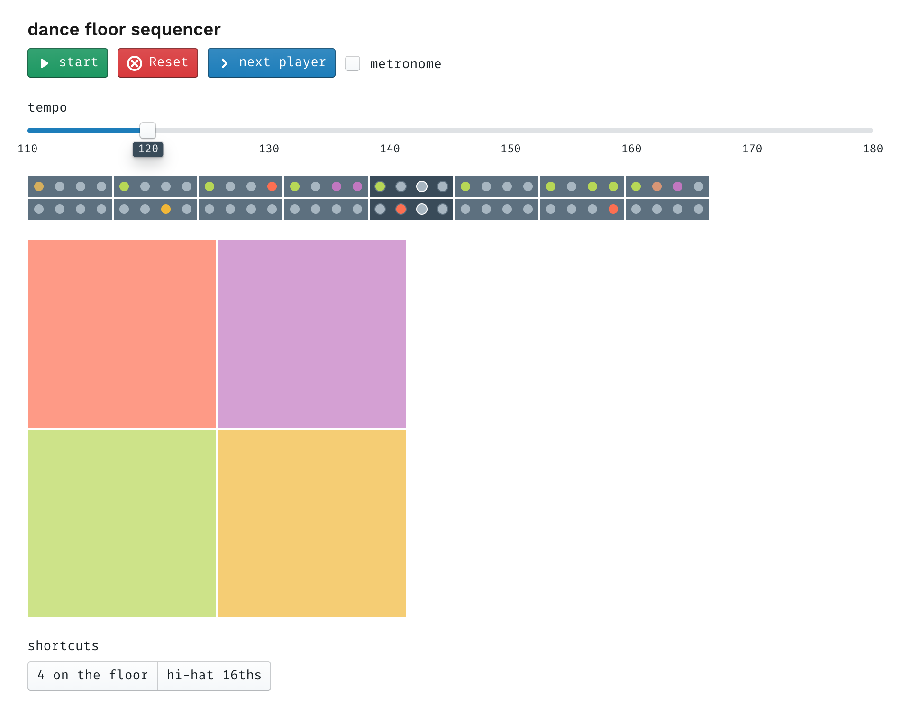

December 2018

Adi Dahiya

## Project idea

I set out to create a matrix of dance floor tiles which act as a controller for a drum rack sampler & step sequencer. The software implements some of the key ideas from an [Akai MPC](https://en.wikipedia.org/wiki/Akai_MPC) and modern digital audio workstations like Ableton. Users are invited to step up to the device, express themselves with a little dance over a 2-bar phrase, and hear back the resulting rhythm produced by the "Dance floor MPC". Successive users can choose to "collaborate" with the previous user's recorded sequence. This is not a precise production tool, but rather a playful experience which enables anyone to enjoy making beats with their body.

<iframe src="https://player.vimeo.com/video/307208842?loop=1&title=0&byline=0&portrait=0" style="position:absolute;top:0;left:0;width:100%;height:100%;" frameborder="0" webkitallowfullscreen mozallowfullscreen allowfullscreen></iframe>

 

There are 8 interactive tiles and one neutral central tile in this interface. Each interactive tile triggers a different drum sample. I encouraged users to start in the neutral tile and used DDR as a starting point to frame the interaction. The console at the front contains four buttons to control the sequencer software and an LED strip interface which reflects the state of the loop transport. The buttons (from left to right are) play/stop, toggle record mode, reset sequence, and change sample bank:

1. __Play/Stop__ toggles the loop transport, either starting the loop from the beginning or stopping the current playback.
2. __Record__ toggles whether the sequencer is recording steps to the current sequence. When this is off, the timeline LED strip color is white, and users can trigger drum sounds without committing them to the sequence. When it is on, pad triggers will get quantized to the nearest step and toggle the respective pad in the sequence. Multiple pads can be triggered at a time.
3. __Reset__ clears the current sequence. If there was a previous sequence active and the current sequence has already been reset, this will clear the previous sequence (so you can start over from scratch).
4. __Change sample bank__ switches the current sequence to use the next available sample bank. I had 3 sample banks available during the winter show.

In addition, the web UI has a few more controls which are not reflected in the hardware. I sometimes used these while demoing the project at the winter show:

- __Next player__ saves the current sequence and creates a new slot for a new sequence to be recorded. Only two sequences can be active at any time, but they can each use different sample banks and they can be cleared ("reset") individually.
- __Shortcuts__ for common patterns like four-on-the-floor kick and (closed) hi-hats on every 16th note.

---

## Application for Winter Show

December 9, 2018

I have a working hardware prototype constructed mostly of cardboard. In the next week I will rebuild this with sturdier materials (foam pads, U-channel aluminum framing) and add more visible lighting with LED strips.

[You can view the current state of the software (and play with it yourself!) here](/projects/physical-computing/dance-floor-sequencer). It can only play [Roland TR-808](https://en.wikipedia.org/wiki/Roland_TR-808) samples right now, but I have already started building support for additional sample banks (feel free to check out my [commit history](https://github.com/adidahiya/website/commits/develop/src/pages/projects/physical-computing)).

<iframe src="https://player.vimeo.com/video/304532875?loop=1&title=0&byline=0&portrait=0" style="position:absolute;top:0;left:0;width:100%;height:100%;" frameborder="0" webkitallowfullscreen mozallowfullscreen allowfullscreen></iframe>

In this video you see me controlling some parts of the experience by clicking buttons in the web UI; the final device will have hardware affordances for common controls (start/stop, advance to next user, change sample bank, etc). The sequencer timeline UI will also become hardware using LED strips (see the sketch at the top of the page) which are placed in front of the pad matrix.

Relevant deadlines:

- Due as a Code of Music final on Monday, December 10
- Due as a Physical Computing final on Wednesday, December 12

At this point I think the biggest risk factor for this project is the timely fabrication of sturdy tiles. I plan to dedicate nearly all of Thurs-Sun to this build, and I think the above deadlines will help as a forcing function to get the project in a good state.

## Progress blog posts

These should give you an idea of my rapid progress over the past few days and how I'm thinking about fabrication:

- [Week 13 - Dance floor MPC progress, part 4](/blog/itp/physical-computing/week-13-dance-floor-mpc-4)
- [Week 13 - Dance floor MPC progress, part 3](/blog/itp/physical-computing/week-13-dance-floor-mpc-3)
- [Week 13 - Dance floor sequencer progress, part 2](/blog/itp/physical-computing/week-13-dance-floor-progress)
- [Week 12 - Dance floor sequencer progress, part 1](/blog/itp/physical-computing/week-12-dance-floor-progress)
- [Week 12 - Dance floor sequencer](/blog/itp/physical-computing/week-12-dance-floor-sequencer)

